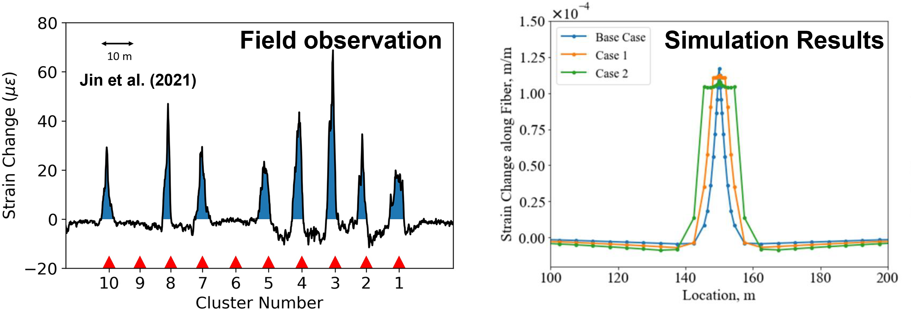
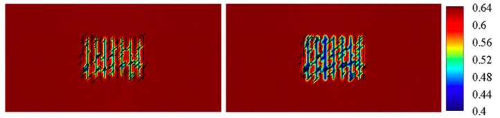
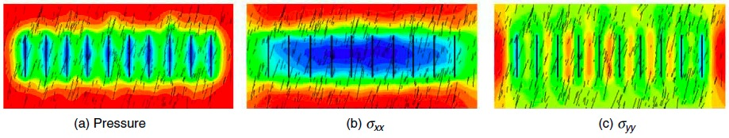
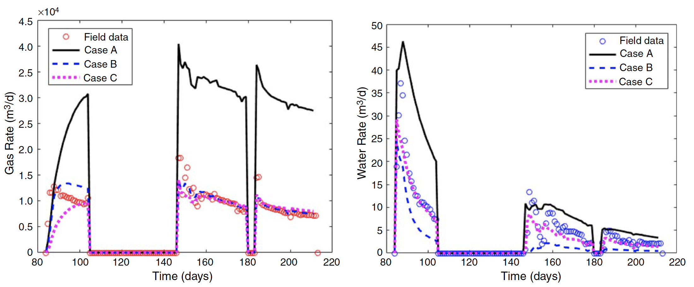

## Hydraulic Fracture Monitoring and Characterization Using Distributed Fiber-Optic Sensing Data

Hydraulic fracturing with plug-and-perf completion technique along horizontal wellbore is widely used in the economic development of unconventional reservoirs. Well performance is directly linked to the stimulated fracture geometry. 
A better understanding of stimulated fracture geometry is critical for improving the efficiency of hydraulic fracturing treatments and optimizing well production. Fiber-optic sensing has proven to be an effcient technology to monitor subsurface activities including hydraulic fracturing. Recently, both cross-well Distributed Acoustic Sesning data during fracturing treatments and in-well Distributed Strain Sensing data during production stage have been acquired. Such direct in-situ measurements provide unique opportunity to characterize near-wellbore and far-field hydraulic fracture geometry.  

### Analysis and Interpretation of Cross-Well Low-Frequency Distributed Acoustic Sensing Data

The Low-Frequency components of Distributed Acoustic Sensing (LF-DAS) data, 
which is a direct in-situ measurement of fracture-induced rock deformation, is a promising attribute for fracture-hit detection and hydraulic-fracture characterization. In this project, we conduct fundamental research on the mechanisms for 
LF-DAS signals, develop inversion algorithms for quantitative hydraulic-fracture geometry characterization, and propose practical workflows for field applications. The figure below shows the general workflow we have developed for LF-DAS data interpretation.

  
   
  <em> General workflow for LFDAS data interpretation</em>

### Inference of Near-Wellbore Fracture Characteristics from In-Well Distributed Strain Sensing Data

Rayleigh frequency-shift-based distributed strain sensing (RFS-based DSS) is a fiber-optic-based diagnostic technique, which can measure the strain change along the fiber during long-term fluid production/injection periods. [Jin et al. 2021](https://doi.org/10.2118/205394-PA) presented a set of DSS data during prodution and shut-in periods from the Hydraulic Fracture Test Site 2 project to demonstrate its potential to characterize near-wellbore fracture properties. In this research, we applied our in-house coupled flow and geomechanics model to simulate the observed DSS signals under various fractured reservoir conditions. This study provides better understandings of the DSS measurements and their relations to the near-wellbore fracture properties, which is of practical importance for near-wellbore fracture characterization and completion/stimulation optimization.

  
   
  <em> DSS strain change along the fiber: field data (left) and simulation result (right)</em>

## Development and Applications of Coupled Multiphase Flow and Geomechanics Models for Fractured Unconventional Reservoirs

Unconventional tight reservoirs, which have contributed significantly to the global hydrocarbon production, are typically characterized by low permeability and low porosity. Although hydraulic fracturing along with horizontal well drilling enables
economic development of such reservoirs, the production rate often declines sharply and results in low primary hydrocarbon recovery. Multiphase flow in fractured porous media is a multi-physics coupled process. To better understand the mechanisms 
controlling the well performance and improve the hydrocarbon recovery, comprehensive numerical models are needed. In this project, we develop coupled flow and geomechanics models, especially for fractured unconventional reservoirs. The models have been
applied in evaluating the efficiency and feasibility of injection-type EOR methods and predicting depletion-induced stress evolution.

### Feasibility and Efficiency of Inter-Fracture Water Injection to Enhance Oil Recovery in Tight Reservoirs
This study investigated the feasibility and efficiency of an innovative fluid injection scheme proposed by [Dombrowski et al. 2015](https://patents.google.com/patent/US20130228337) for enhancing tight oil recovery.

  
   
  <em> Oil saturation distribution after inter-fracture water injection under lower rate (left) and higher rate (right)</em>

### Depletion-Induced Stress Re-Distribution in Shale-Gas Reservoirs
This study investigated the stress distributions in a depleted shale-gas reservoir under various in-situ conditions, which is essential for the design and optimization of re-fracturing and infill-well drilling.

  
   
  <em> pressure and stresses distribution in a naturally fractured shale-gas reservoir after 1500 days depletion</em>

## Fracturing Fluid Flowback and In-Situ Distribution in Unconventional Reservoirs
During hydraulic fracturing treatments, a large amount of fracturing fluid is injected into the tight subsurface formation. However, only a small portion of injected fluid can be recovered during the flowback process. Fracture closure, gravity segregation,
proppant distribution, matrix capillarity, and shut-in time have been widely postulated to be the contributing factors. In this project, we examine the effects of these factors on fracturing-fluid distribution and subsequent well performance using
flow and geomechanical simulations. Finally, two real-field exampled are used to validate the findings in this research. 

  
   
  <em> history matching of flowback data of a field example; flowback data help reduce uncertainties. </em>

