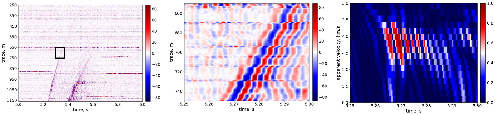
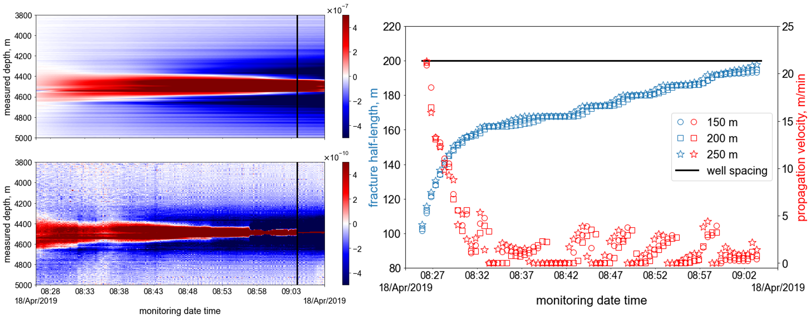
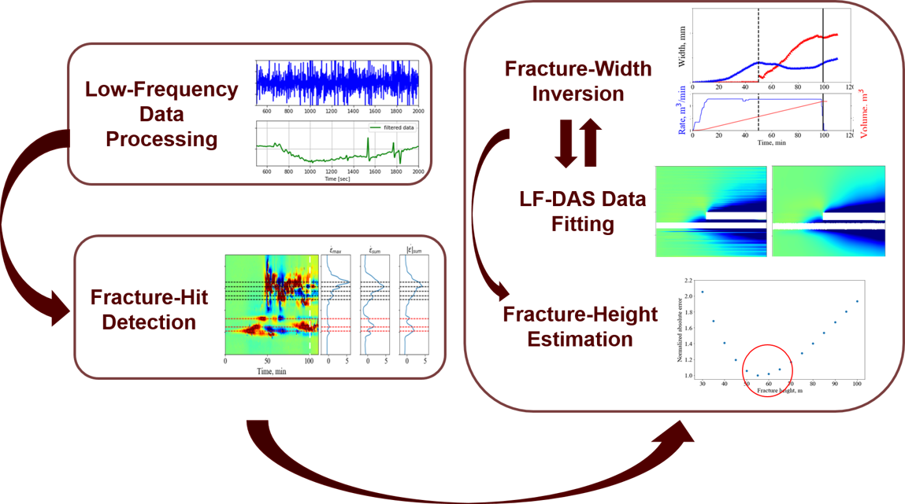
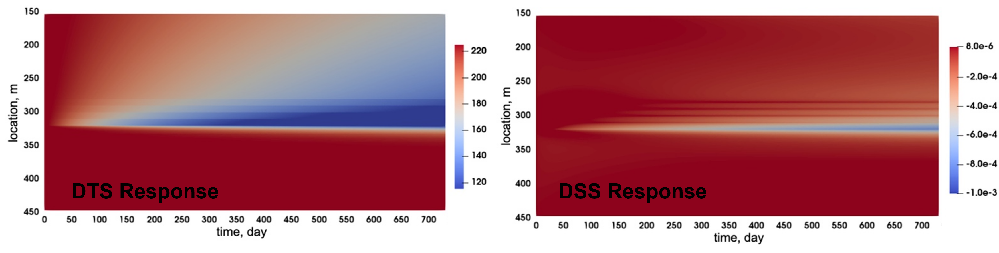

Each project has associated paper(s) for reference. For more details, please refer to our papers listed in the Publications page.

## Automated Real-Time Microseismic Event Detection Using Distributed Acoustic Sensing Data
Distributed acoustic sensing (DAS) can provide high-resolution measurements owing to the closely spaced sensing channels over a long distance and high sampling rate – attributes that are beneficial to seismic monitoring and analysis. However, DAS arrays generally suffer from a lower signal-to-noise ratio (SNR). Additionally, dense spatial and temporal measurements can result in extremely large data volumes that hinder efficient data storage, transmission, and processing. In this study, we present a microseismic event detection workflow that is based on coherency analysis of the waveforms and accommodates the high-resolution characteristics of DAS data. DAS data is transformed into an apparent velocity-time (v-t) domain by slant-stacking the data along different apparent velocities, i.e., slopes of the waveform, at each time sample. The coherency of the slant-stacked waveform is measured by the semblance coefficient. A coherent signal is identified if the semblance coefficient is larger than a threshold that is adaptively calculated. Finally, the microseismic events are detected by filtering out the clusters of coherent noise.

  
   
  <em> waveform coherency-based event detection for DAS data (v-t transform)</em>

## Hydraulic Fracture Monitoring and Characterization Using Distributed Fiber-Optic Sensing Data

Hydraulic fracturing with plug-and-perf completion technique along horizontal wellbore is widely used in the economic development of unconventional reservoirs. Well performance is directly linked to the stimulated fracture geometry. 
A better understanding of stimulated fracture geometry is critical for improving the efficiency of hydraulic fracturing treatments and optimizing well production. Fiber-optic sensing has proven to be an effcient technology to monitor subsurface activities including hydraulic fracturing. Recently, both cross-well Distributed Acoustic Sesning data during fracturing treatments and in-well Distributed Strain Sensing data during production stage have been acquired. Such direct in-situ measurements provide unique opportunity to characterize near-wellbore and far-field hydraulic fracture geometry.  

### Inference of Hydraulic Fracture Tip Advancement from Cross-Well Low-Frequency Distributed Acoustic Sensing Data before Fracture Hit
Characterizing the fluid-driven fracture tip advancing process presents a significant challenge due to the difficulty of replicating real-world conditions in laboratory experiments and the lack of precise field measurements. However, recent advances in low-frequency distributed acoustic sensing (LF-DAS) technology offer new opportunities to investigate the dynamics of propagating hydraulic fractures. In this study, we propose an iterative inversion method to characterize fracture-tip advancing behaviors using LF-DAS data before fracture hit. After validating the developed inversion algorithm, we applied it to a field case with a single-cluster hydraulic fracturing treatment from the Hydraulic Fracturing Test Site 2 project (HFTS2). The inversion results of this specific field case reveal that the fracture propagates intermittently, as evidenced by the fracture half-length evolution and propagation velocity.

  
   
  <em> Waterfall plots of LF-DAS strain and strain-rate data before fracture hit (left) and inversion results of fracture half-length and propagation velocity (right)</em>

### Analysis and Interpretation of Cross-Well Low-Frequency Distributed Acoustic Sensing Data after Fracture Hit

The Low-Frequency components of Distributed Acoustic Sensing (LF-DAS) data, 
which is a direct in-situ measurement of fracture-induced rock deformation, is a promising attribute for fracture-hit detection and hydraulic-fracture characterization. In this project, we conduct fundamental research on the mechanisms for 
LF-DAS signals, develop inversion algorithms for quantitative hydraulic-fracture geometry characterization, and propose practical workflows for field applications. The figure below shows the general workflow we have developed for LF-DAS data interpretation.

  
   
  <em> General workflow for interpretation of LFDAS data after fracture hit</em>

### Inference of Near-Wellbore Fracture Characteristics from In-Well Distributed Strain Sensing Data

Rayleigh frequency-shift-based distributed strain sensing (RFS-based DSS) is a fiber-optic-based diagnostic technique, which can measure the strain change along the fiber during long-term fluid production/injection periods. [Jin et al. 2021](https://doi.org/10.2118/205394-PA) presented a set of DSS data during prodution and shut-in periods from the Hydraulic Fracture Test Site 2 project to demonstrate its potential to characterize near-wellbore fracture properties. In this research, we applied our in-house coupled flow and geomechanics model to simulate the observed DSS signals under various fractured reservoir conditions. This study provides better understandings of the DSS measurements and their relations to the near-wellbore fracture properties, which is of practical importance for near-wellbore fracture characterization and completion/stimulation optimization.

  
   
  <em> DSS strain change along the fiber: field data (left) and simulation result (right)</em>

### Monitoring and Optimizing Water Circulation in Enhanced Geothermal Systems
The success of multi-stage hydraulic fracturing technology in unconventional oil and gas reservoir development has attracted much attention from the geothermal community. Some pilot field experiments have been conducted to investigate the multi-stage hydraulic stimulation along horizontal or high-deviated wellbores in geothermal reservoirs. One common output of such stimulation is that the created hydraulic fractures show various conductive capabilities, which could potentially lead to undesirable flow localization, early thermal breakthrough, and low cold water sweep efficiency. Monitoring the water circulation between horizontal wellbores connected through hydraulic fractures becomes important in avoiding early severe producing temperature reduction in practical operations. In this study, we investigate the effectiveness of distributed temperature sensing (DTS) and distributed strain sensing (DSS) in identifying dominant flow paths in geothermal reservoirs with multi-stage hydraulic stimulation and horizontal well completion designs.

  
   
  <em> Synthetic DTS and DSS responses</em>

## Development and Applications of Coupled Thermal-Hydraulic-Mechanical (THM) Models for Fractured Subsurface Reservoirs

Thermal multiphase flow in fractured porous media is a multi-physics coupled process. To better understand the mechanisms 
controlling the fluid flow and heat transport in deformable subsurface reservoirs, comprehensive numerical models are needed. In this project, we develop coupled fluid flow, heat transport and geomechanics models for fractured deep reservoirs, such as unconventional hydrocarbon reservoirs and enhanced geothermal systems. The models have already been
applied in various areas, including evaluating the efficiency and feasibility of injection-type EOR methods, predicting depletion-induced stress evolution, and heat recovery from geothermal reservoirs.

### Feasibility and Efficiency of Inter-Fracture Water Injection to Enhance Oil Recovery in Tight Reservoirs
This study investigated the feasibility and efficiency of an innovative fluid injection scheme proposed by [Dombrowski et al. 2015](https://patents.google.com/patent/US20130228337) for enhancing tight oil recovery.

  
   
  <em> Oil saturation distribution after inter-fracture water injection under lower rate (left) and higher rate (right)</em>

### Depletion-Induced Stress Re-Distribution in Shale-Gas Reservoirs
This study investigated the stress distributions in a depleted shale-gas reservoir under various in-situ conditions, which is essential for the design and optimization of re-fracturing and infill-well drilling.

  
   
  <em> pressure and stresses distribution in a naturally fractured shale-gas reservoir after 1500 days depletion</em>

## Fracturing Fluid Flowback and In-Situ Distribution in Unconventional Reservoirs
During hydraulic fracturing treatments, a large amount of fracturing fluid is injected into the tight subsurface formation. However, only a small portion of injected fluid can be recovered during the flowback process. Fracture closure, gravity segregation,
proppant distribution, matrix capillarity, and shut-in time have been widely postulated to be the contributing factors. In this project, we examine the effects of these factors on fracturing-fluid distribution and subsequent well performance using
flow and geomechanical simulations. Finally, two real-field exampled are used to validate the findings in this research. 

  
   
  <em> history matching of flowback data of a field example; flowback data help reduce uncertainties. </em>

