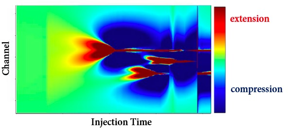

## Application of Low-Frequency Distributed Acoustic Sensing (LF-DAS) Technique in Quantitative Hydraulic Fracture Characterization

Hydraulic fracturing with plug-and-perf completion technique along horizontal wellbore is widely used in the economic development of unconventional reservoirs. Well performance is directly linked to the stimulated fracture geometry. 
A better understanding of stimulated fracture geometry is critical for improving the efficiency of hydraulic fracturing treatments and optimizing well production. The Low-Frequency components of Distributed Acoustic Sensing (LF-DAS) data, 
which is a direct in-situ measurement of fracture-induced rock deformation, is a promising attribute for fracture-hit detection and hydraulic-fracture characterization. In this project, we conduct fundamental research on the mechanisms for 
LF-DAS signals, develop inversion algorithms for quantitative hydraulic-fracture geometry characterization, and propose practical workflows for field applications.

  
   
  <em> A numerical simulation example: strain-rate waterfall plot</em>

